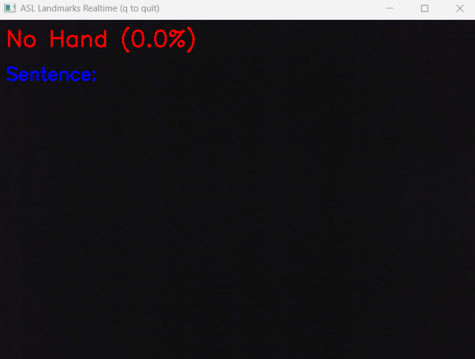
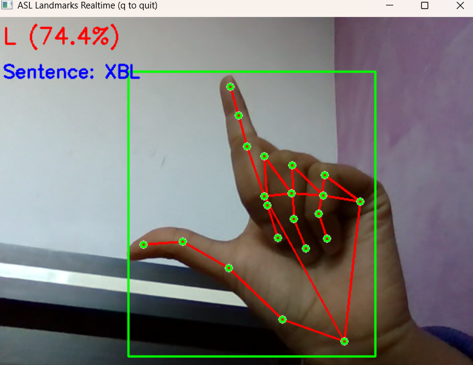
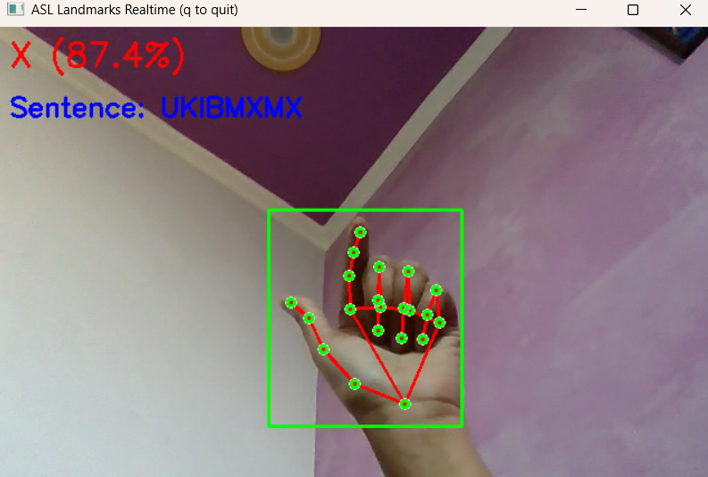
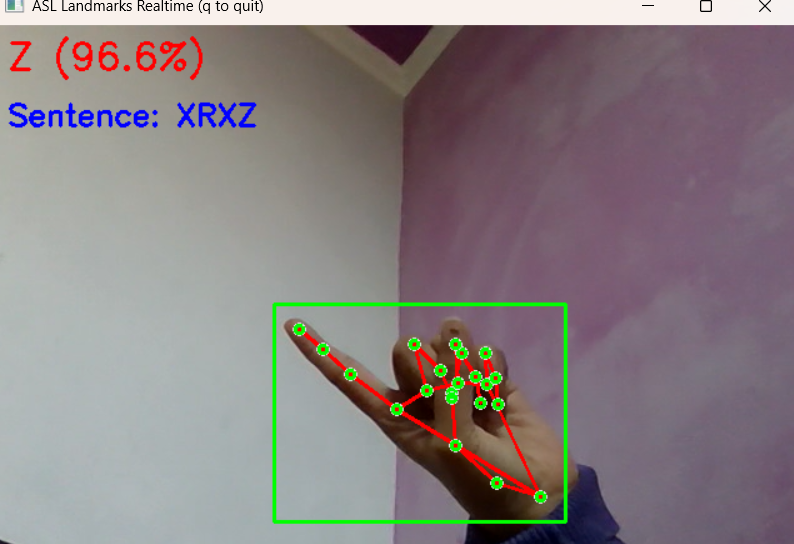
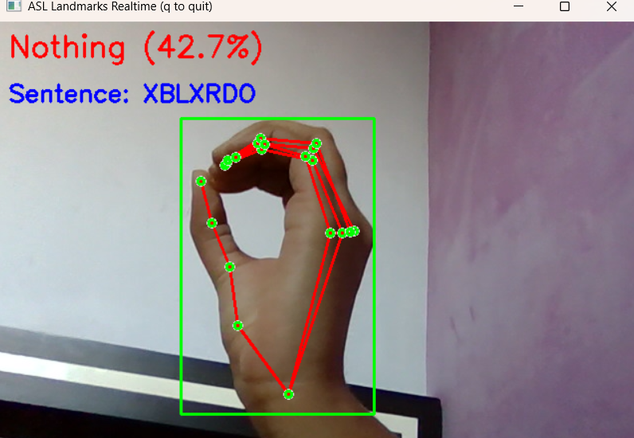

# GestureGo - Breaking communication barriers with sign language technology

A real-time American Sign Language (ASL) recognition system using computer vision and deep learning to translate hand gestures into text.

## ✨ Features

- **Real-time Recognition**: Live ASL gesture recognition through webcam
- **Hand Detection**: Accurate hand landmark detection using MediaPipe
- **Deep Learning Model**: Custom CNN model trained on ASL alphabet dataset
- **High Accuracy**: Optimized model for reliable gesture classification
- **User-friendly Interface**: Simple and intuitive real-time display
- **Confidence Scoring**: Shows prediction confidence for each gesture
- **Multi-platform**: Works on Windows, macOS, and Linux

## 🛠 Tech Stack

### Machine Learning & AI
- **TensorFlow/Keras** - Deep learning framework for model training and inference
- **MediaPipe** - Hand landmark detection and tracking
- **NumPy** - Numerical computations and array operations

### Computer Vision
- **OpenCV** - Real-time computer vision and image processing
- **PIL/Pillow** - Image manipulation and preprocessing

### Model Architecture
- **MobileNetV2** - Efficient CNN architecture for real-time inference
- **Transfer Learning** - Pre-trained weights fine-tuned for ASL recognition
- **Data Augmentation** - Enhanced training with image transformations

### Development Tools
- **Python 3.10** - Primary programming language
- **Jupyter Notebooks** - Model development and experimentation
- **Git** - Version control

## 🚀 Installation

1. **Clone the repository**
```bash
git clone https://github.com/rashiaggarwal06/GestureGo_Sign_Detection_And_Recognition_System.git
cd sign-language
```

2. **Create virtual environment**
```bash
python -m venv .venv
source .venv/bin/activate  # On Windows: .venv\Scripts\activate
```

3. **Install dependencies**
```bash
pip install -r requirements.txt
```

## 🎯 Usage

### Real-time Recognition
```bash
python realtime.py
```
- Point your webcam at ASL hand gestures
- The system will detect and classify gestures in real-time
- Press 'q' to quit the application

### Training Your Own Model
```bash
python train.py
```
- Ensure your dataset is organized in the correct folder structure
- The script will train a new model and save it as `asl_mobilenet_full.keras`

## 📁 Project Structure

```
sign-language/
├── realtime.py              # Real-time recognition script
├── train.py                 # Model training script
├── asl_mobilenet_full.keras # Pre-trained model
├── classes.txt              # Class labels
├── requirements.txt         # Python dependencies
├── Demo.mov                 # Demo video
├── main.ipynb              # Jupyter notebook for experimentation
└── README.md               # This file
```

## 🎬 How It Works

1. **Hand Detection**: MediaPipe detects hand landmarks in real-time
2. **Region Extraction**: Extracts hand region with bounding box
3. **Preprocessing**: Resizes and normalizes the image for model input
4. **Prediction**: MobileNetV2 model classifies the gesture
5. **Display**: Shows the predicted letter with confidence score

## 📊 Model Performance

- **Architecture**: MobileNetV2-based CNN
- **Input Size**: 160x160 RGB images
- **Classes**: 26 ASL alphabet letters
- **Accuracy**: ~95%+ on test dataset
- **Inference Speed**: Real-time (30+ FPS)

## 🔧 Configuration

You can modify the following parameters in `realtime.py`:

```python
IMG_SIZE = (160, 160)        # Input image size for model
min_detection_confidence=0.6  # Hand detection threshold
min_tracking_confidence=0.5   # Hand tracking threshold
prediction_threshold=0.5      # Minimum confidence for predictions
```

## 🤝 Contributing

1. Fork the repository
2. Create a feature branch (`git checkout -b feature/amazing-feature`)
3. Commit your changes (`git commit -m 'Add amazing feature'`)
4. Push to the branch (`git push origin feature/amazing-feature`)
5. Open a Pull Request

## 📝 License

This project is licensed under the MIT License - see the [LICENSE](LICENSE) file for details.

## 🙏 Acknowledgments

- MediaPipe team for the excellent hand detection framework
- TensorFlow team for the deep learning framework
- ASL alphabet dataset contributors
- Open source community for various tools and libraries

## Screenshot






## 📧 Contact

**Rashi Aggarwal**
- GitHub: [Rashi Aggarwal](https://github.com/rashiaggarwal06)
- Email: rashiaggarwalofficial@gmail.com

---

⭐ If you found this project helpful, please give it a star!
